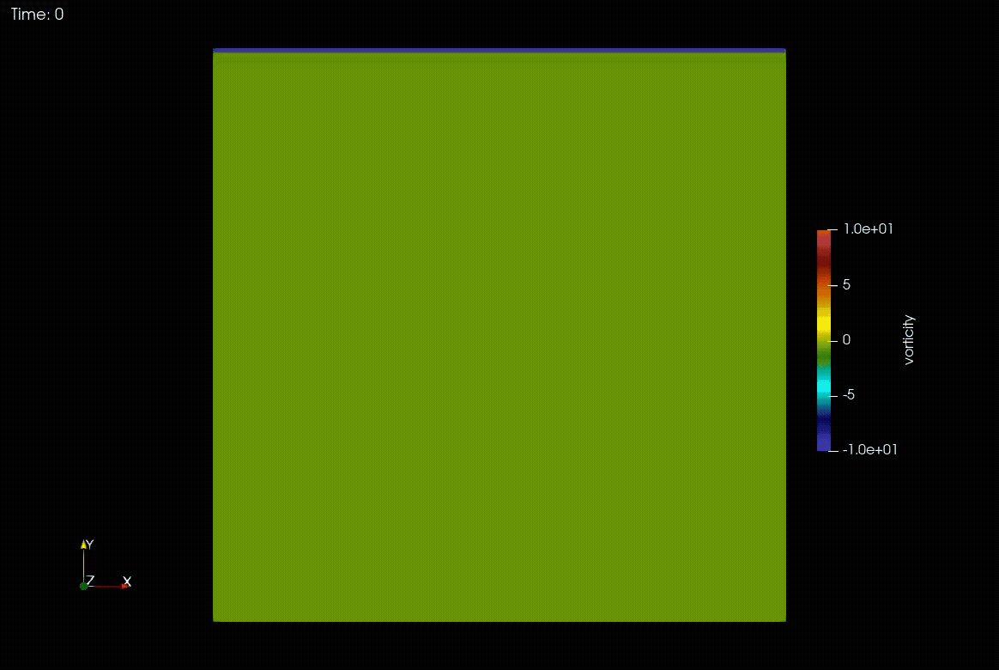

# cnavier

Explicit incompressible Navier-Stokes solver written in C.

Solves the 2D lid-driven cavity problem using the **vorticity-streamfunction formulation**, which eliminates pressure from the equations and enforces incompressibility exactly.

## Results



*Vorticity field for the lid-driven cavity at Re=1000.*

## Method

The governing equations are:

```
∂ω/∂t + u·∂ω/∂x + v·∂ω/∂y = (1/Re) ∇²ω          (vorticity transport)
∇²ψ = −ω                                        (Poisson equation)
u = ∂ψ/∂y,  v = −∂ψ/∂x                          (velocity recovery)
ω = ∂v/∂x − ∂u/∂y                               (vorticity definition)
```

At each timestep:
1. Compute vorticity boundary conditions from current velocity field
2. Evaluate spatial derivatives of ω using finite differences
3. Advance ω in time (Euler or RK4)
4. Solve the Poisson equation for ψ
5. Recover u and v from ψ

## Features

- **Spatial discretisation**: finite differences of selectable order (2nd, 4th, or 6th)
- **Time integration**: explicit Euler or classical RK4 (4th-order accurate)
- **Poisson solver**: three options — Gauss-Seidel, SOR, or FFTW3-based direct DST-I solver (default)
- **Sparse operators**: 2D derivative operators built as CSR sparse matrices via Kronecker products, replacing dense O(n³) matrix-vector multiplies with O(7n) SpMV
- **GPU acceleration**: optional CUDA backend that runs the whole time loop on an NVIDIA GPU (see [CUDA](#cuda-gpu))
- **Output**: VTK files for visualisation in ParaView

## Dependencies

- `gcc`
- `libfftw3` — required for the FFT Poisson solver
- **OpenMP** — optional; used only if you build with `make OPENMP=1` (see below)
- **CUDA toolkit** (`nvcc`, cuFFT) and an NVIDIA GPU — optional; used only if you build with `make CUDA=1` (see [CUDA](#cuda-gpu))

**Ubuntu/Debian**
```bash
sudo apt install libfftw3-dev
```

For parallel builds, install a full GCC toolchain (OpenMP comes with GCC as **libgomp**; nothing extra beyond the compiler is usually required):
```bash
sudo apt install build-essential
```

**Arch Linux**
```bash
sudo pacman -S fftw
```

GCC on Arch already includes OpenMP support for `make OPENMP=1`.

**macOS**
```bash
brew install fftw
```

Apple’s default compiler is often Clang without OpenMP enabled for `-fopenmp`. To use OpenMP, install GCC from Homebrew and point `CC` at it (the exact version suffix may vary):
```bash
brew install gcc
CC=gcc-14 make OPENMP=1
```
Alternatively, install `libomp` and use Clang with the appropriate `-fopenmp` / `-lomp` flags if you maintain a custom toolchain.

### OpenMP (quick facts)

You typically **do not** install a package named “openmp” alone. **GCC** implements OpenMP and links the runtime (**libgomp** on Linux). If `gcc -fopenmp` works on your system, `make OPENMP=1` should work.

## Build

```bash
make
```

Optional **OpenMP** (shared-memory parallelism in the hot loops — SpMV, Euler/RK4 RHS, Poisson):

```bash
make OPENMP=1
```

Thread count follows `OMP_NUM_THREADS` (and the OpenMP runtime defaults). The default `make` build is unchanged (no OpenMP).

Optional **CUDA** (GPU) build — see [CUDA](#cuda-gpu) for details:

```bash
make CUDA=1
```

Switching between `make`, `make OPENMP=1` and `make CUDA=1` rebuilds everything automatically; no `make clean` is needed in between.

This produces the `cnavier` binary. Output VTK files are written to `output/` — create it first:

```bash
mkdir -p output
./cnavier
```

To clean build artifacts:
```bash
make clean
```

## CUDA (GPU)

`make CUDA=1` builds the same `cnavier` binary with a GPU backend. It is entirely optional: the default build does not need CUDA, and a CUDA build started on a machine without a usable GPU prints a notice and runs on the CPU.

**Requirements**: an NVIDIA GPU with a working driver, and the CUDA toolkit (`nvcc` and cuFFT). On Ubuntu/Debian the distribution package is enough:

```bash
sudo apt install nvidia-cuda-toolkit
```

NVIDIA's own packages work too. `nvcc` is taken from `PATH`, falling back to `/usr/local/cuda/bin/nvcc`; set `NVCC` or `CUDA_HOME` to point elsewhere:

```bash
make CUDA=1 CUDA_HOME=/opt/cuda
```

**Usage**: a CUDA build uses the GPU by default. Pass `--cpu` to run the CPU path from the same binary, which is handy for comparing the two:

```bash
./cnavier          # GPU
./cnavier --cpu    # CPU
```

**What runs on the GPU**: everything inside the time loop. The fields (`u`, `v`, `ω`, `ψ`, RK4 stages) and the four CSR derivative operators are uploaded once and stay on the device; boundary conditions, derivatives (CSR SpMV kernels), Euler/RK4 and all three Poisson solvers run as kernels. Data returns to the host only for the VTK files, the per-iteration continuity min/max and the final centerline profiles. All arithmetic is double precision, as on the CPU.

- *FFT solver*: cuFFT has no sine transform, so the DST-I is computed as a real-to-complex FFT of the odd extension of the field (size `2(nx+1) × 2(ny+1)`).
- *Gauss-Seidel / SOR*: red-black ordering, the same one the OpenMP build uses, with the same stopping rule.

**Agreement with the CPU**

- *FFT solver*: on the default case (Re=100, 64×64, RK4 + FFT, 6000 steps) the GPU and CPU runs write identical centerline profiles and byte-identical VTK files.
- *Gauss-Seidel / SOR*: the answer depends on which CPU build you compare with. The default tolerance (`poisson_tol = 1E-3`) stops the iteration well before convergence, so the sweep order shows in the result. Against the `OPENMP=1` build, which also sweeps red-black, the GPU takes the same number of iterations and agrees to round-off. Against the default serial build, which sweeps lexicographically, it does not: with SOR on the default case the iteration counts differ (67 against 90 on the first solve) and the centerline velocities differ by about 2e-5. The two only meet when the tolerance is tight enough for the iteration to converge.

`make CUDA=1 test` checks every GPU building block and full timesteps against the CPU (see [Tests](#tests)).

### Performance

Time per timestep, RK4 + FFT, Re=100, `dt = 10/n²`, VTK output off. Measured on an Intel i7-12650H and an NVIDIA GeForce RTX 3050 Laptop GPU (4 GB) under WSL2 (Ubuntu 22.04, gcc 11.4, CUDA 11.5):

| Grid | CPU, `make` | CPU, `-O2` | OpenMP, `-O2`, 8 threads | CUDA | CUDA vs CPU `-O2` |
|---|---|---|---|---|---|
| 63×63 | 2.19 ms | 1.14 ms | 0.98 ms | 0.87 ms | 1.3× |
| 127×127 | 8.98 ms | 3.68 ms | 3.31 ms | 1.61 ms | 2.3× |
| 255×255 | 39.6 ms | 19.9 ms | 15.5 ms | 5.01 ms | 4.0× |
| 511×511 | 162 ms | 91.8 ms | 67.0 ms | 20.9 ms | 4.4× |
| 1023×1023 | 804 ms | 486 ms | 301 ms | 82.4 ms | 5.9× |

These are single runs on a laptop; repeat runs vary by 10–15%. The default `make` compiles without optimisation; the `-O2` columns were built with `make CC="gcc -O2"`. Each row is a run such as:

```bash
./cnavier --n 511 --dt 3.83e-5 --tf 7.68e-3 --output-interval 0
```

Things to keep in mind:

- The GPU pays off from roughly 127×127 upwards. On small grids the fixed cost of launching kernels dominates and the CPU is just as fast.
- About 60% of the GPU time at 511×511 is the double-precision FFTs. Consumer GeForce cards are much slower in double than in single precision, so expect larger gains on workstation/datacenter GPUs.
- Pick grid sizes where `n + 1` has only small prime factors (63, 127, 255, 511, 1023, ...). The sine transform works on length `2(n+1)`, and awkward lengths are slow on both backends: 1024×1024 takes 132 ms per step on the GPU and 624 ms on the CPU, against 82 ms and 486 ms for 1023×1023.
- The table is for the FFT solver only. Gauss-Seidel and SOR are on the GPU so that every solver option works there, not because they are fast: the convergence test after each sweep copies a value back to the host, and on the default 64×64 case SOR takes tens of milliseconds per step on the GPU, about the same as the unoptimised CPU build and far behind the FFT solver's 1 ms.

## Configuration

All parameters are set at the top of `src/main.c`:

### Physical
| Parameter | Default | Description |
|---|---|---|
| `Re` | `100` | Reynolds number |
| `Lx`, `Ly` | `1` | Domain size |

### Numerical
| Parameter | Default | Description |
|---|---|---|
| `nx`, `ny` | `64` | Grid points in x and y |
| `dt` | `0.005` | Time step |
| `tf` | `30` | Final time |
| `order` | `6` | Finite difference order (2, 4, or 6) |
| `time_scheme` | `2` | `1` = Euler, `2` = RK4 |
| `poisson_type` | `3` | `1` = Gauss-Seidel, `2` = SOR, `3` = FFT |
| `output_interval` | `20` | Write VTK every N iterations |

### Command-line options
A few numerical parameters can be overridden without recompiling; anything not given keeps its value from `src/main.c`:

| Option | Description |
|---|---|
| `--n N` | Grid points per side; the grid is N×N (non-square grids are not supported) |
| `--dt DT` | Time step |
| `--tf TF` | Final time |
| `--output-interval N` | Write VTK every N iterations (`0` disables VTK output) |
| `--cpu` | CUDA builds only: run on the CPU instead of the GPU |
| `--help` | Show the option list |

The time step has to shrink with the grid spacing: the run stops at start-up if `dt/dx > 1`, and the explicit schemes also need `dt` to scale with `dx²` (the benchmarks above use `dt = 10/n²` at Re=100).

```bash
./cnavier --n 127 --dt 6.2e-4 --tf 20
```

Values that cannot be used (not a number, a grid outside 8–16384, `tf/dt` below one step or beyond the integer range) are rejected with an error before anything is computed or written.

The wall-clock time of the time loop is printed at the end of every run.

### Boundary conditions
The default case is the **lid-driven cavity**: the top wall moves at u=1, all other walls are stationary no-slip. Boundary conditions are set via `u1`–`u4` and `v1`–`v4` in `main.c`.

## Output

VTK files are written to `output/` and can be opened in [ParaView](https://www.paraview.org/). The vorticity field is exported by default; stream function, velocity components, and pressure can be enabled by uncommenting the relevant `printvtk` calls in `main.c`.

## Tests

```bash
make test
```

builds and runs `test_cnavier`, which checks the CPU solver: the FFT Poisson solver against an exact eigenmode, the Gauss-Seidel/SOR residuals, and short cavity runs with both time schemes.

```bash
make CUDA=1 test
```

additionally checks the GPU backend against the CPU: SpMV for all four operators, each Poisson solver, the continuity diagnostic, and full timesteps for the Euler/RK4 and FFT/SOR/Gauss-Seidel combinations on several grid sizes. These comparisons are what keeps the GPU code in step with the CPU code, so run them on a machine with a GPU after changing either.

```bash
make OPENMP=1 CUDA=1 test
```

adds the comparison of the iterative solvers at the default tolerance, which is only meaningful when the CPU sweeps in the same red-black order as the GPU.

The exit status tells the three outcomes apart:

| Status | Meaning |
|---|---|
| `0` | every check ran and passed |
| `1` | at least one check failed |
| `77` | nothing failed, but the GPU tests could not run because no usable CUDA device was found |

A CUDA build tested on a machine without a GPU therefore does **not** count as a pass: the summary line says how many GPU tests were skipped and `make` reports an error.

GitHub Actions (`.github/workflows/ci.yml`) runs the CPU tests for the serial and OpenMP builds, and compiles the CUDA build. The hosted runners have no GPU, so the GPU-vs-CPU checks are not run there.

## Project structure

```
cnavier/
├── .github/workflows/
│   └── ci.yml          # CPU tests, CUDA compile check
├── src/
│   ├── main.c          # Simulation loop and configuration
│   ├── linearalg.c     # Dense and sparse (CSR) linear algebra
│   ├── finitediff.c    # Finite difference operators (dense + sparse)
│   ├── fluiddyn.c      # Timestep, Euler/RK4 time integration, vorticity, continuity
│   ├── poisson.c       # Gauss-Seidel, SOR, and FFT Poisson solvers
│   ├── cudasolver.cu   # CUDA backend (built only with CUDA=1)
│   └── utils.c         # VTK output, random utilities
├── include/
│   ├── linearalg.h
│   ├── finitediff.h
│   ├── fluiddyn.h
│   ├── poisson.h
│   ├── cudasolver.h
│   └── utils.h
├── tests/
│   └── test_solver.c   # CPU tests and GPU-vs-CPU checks
├── output/             # VTK output files
├── Re1000_cavity_flow_example.png
├── Re1000_cavity_flow_example.mp4
├── LICENSE
├── Makefile
└── README.md
```

## Notes on the FFT Poisson solver

The default `poisson_type = 3` uses FFTW3's `RODFT00` plan (DST-I) to solve the Poisson equation exactly in O(n² log n). This is orders of magnitude faster than the iterative solvers at high Reynolds numbers where many iterations are required for convergence. FFTW plans are computed once at startup via `fft_setup()` and reused every timestep.

With RK4 (`time_scheme = 2`), the Poisson equation is solved once per RK4 stage (5 solves per timestep total). Since each solve is O(n² log n), this remains fast and gives 4th-order temporal accuracy.
