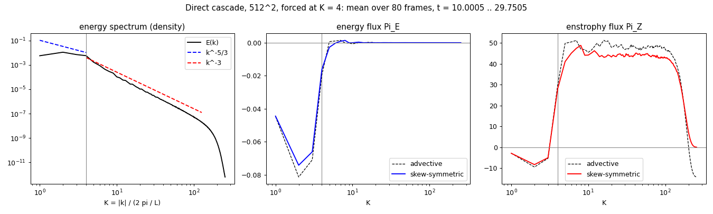
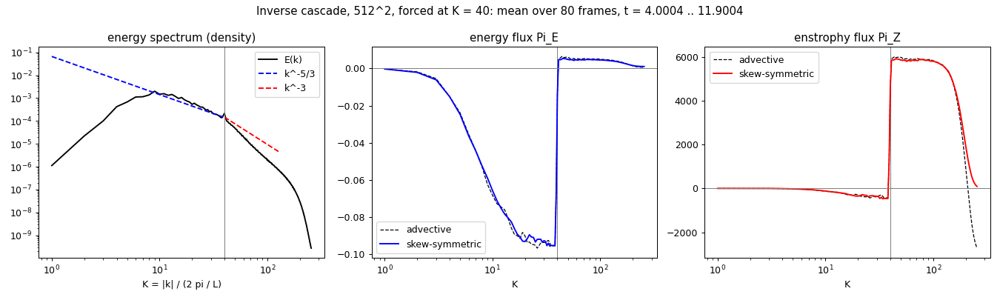
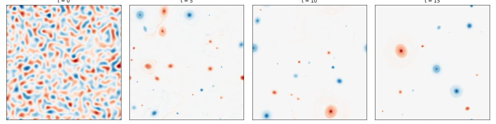

# cnavier

Explicit incompressible Navier-Stokes solver written in C.

Solves the 2D lid-driven cavity problem using the **vorticity-streamfunction formulation**, which eliminates pressure from the equations and enforces incompressibility exactly.

## Results


*Vorticity field for the lid-driven cavity at Re=1000.*

## Method

The governing equations are:

```
∂ω/∂t + u·∂ω/∂x + v·∂ω/∂y = (1/Re) ∇²ω          (vorticity transport)
∇²ψ = −ω                                        (Poisson equation)
u = ∂ψ/∂y,  v = −∂ψ/∂x                          (velocity recovery)
ω = ∂v/∂x − ∂u/∂y                               (vorticity definition)
```

At each timestep:
1. Compute vorticity boundary conditions from current velocity field
2. Evaluate spatial derivatives of ω using finite differences
3. Advance ω in time (Euler or RK4; each RK4 stage solves for its own velocity and recomputes the wall vorticity from it)
4. Solve the Poisson equation for ψ
5. Recover u and v from ψ
6. Recompute the wall vorticity from the new velocity, so the ω that is returned and written out matches u and v at the walls

## Features

- **Spatial discretisation**: finite differences of selectable order (2nd, 4th, or 6th)
- **Time integration**: explicit Euler (1st order) or classical RK4 (4th order in time; the wall vorticity is updated at every stage and at the end of each step)
- **Poisson solver**: three options — Gauss-Seidel, SOR, or FFTW3-based direct DST-I solver (default)
- **Boundaries**: the lid-driven cavity (four walls), or a doubly periodic domain with a periodic FFT Poisson solver (Taylor-Green vortex and double shear layer cases)
- **Sparse operators**: 2D derivative operators built as CSR sparse matrices via Kronecker products, replacing dense O(n³) matrix-vector multiplies with O(7n) SpMV
- **GPU acceleration**: optional CUDA backend that runs the whole time loop on an NVIDIA GPU (see [CUDA](#cuda-gpu))
- **2-D turbulence** (periodic grid): Kolmogorov and random forcing, drag, hyperviscosity and hypodrag, an enstrophy-conserving skew-symmetric nonlinear term, decaying turbulence, and spectra and spectral fluxes with exact discrete budgets (see [2-D turbulence](#two-dimensional-turbulence))
- **Output**: VTK files for visualisation in ParaView

## Dependencies

- `gcc`
- `libfftw3` — required for the FFT Poisson solver
- **OpenMP** — optional; used only if you build with `make OPENMP=1` (see below)
- **CUDA toolkit** (`nvcc`, cuFFT) and an NVIDIA GPU — optional; used only if you build with `make CUDA=1` (see [CUDA](#cuda-gpu))

**Ubuntu/Debian**
```bash
sudo apt install libfftw3-dev
```

For parallel builds, install a full GCC toolchain (OpenMP comes with GCC as **libgomp**; nothing extra beyond the compiler is usually required):
```bash
sudo apt install build-essential
```

**Arch Linux**
```bash
sudo pacman -S fftw
```

GCC on Arch already includes OpenMP support for `make OPENMP=1`.

**macOS**
```bash
brew install fftw
```

Apple’s default compiler is often Clang without OpenMP enabled for `-fopenmp`. To use OpenMP, install GCC from Homebrew and point `CC` at it (the exact version suffix may vary):
```bash
brew install gcc
CC=gcc-14 make OPENMP=1
```
Alternatively, install `libomp` and use Clang with the appropriate `-fopenmp` / `-lomp` flags if you maintain a custom toolchain.

### OpenMP (quick facts)

You typically **do not** install a package named “openmp” alone. **GCC** implements OpenMP and links the runtime (**libgomp** on Linux). If `gcc -fopenmp` works on your system, `make OPENMP=1` should work.

## Build

```bash
make
```

Optional **OpenMP** (shared-memory parallelism in the hot loops — SpMV, Euler/RK4 RHS, Poisson):

```bash
make OPENMP=1
```

The default `make` build is unchanged (no OpenMP). Results are bit-identical to the serial build with any number of threads (with Gauss-Seidel/SOR, identical to other OpenMP runs: the parallel sweep order differs from the serial one).

**Threads.** Without `OMP_NUM_THREADS`, the solver uses one thread per physical core it may run on (the distinct cores among the CPUs in its affinity mask, read from Linux sysfs; elsewhere the OpenMP default applies) and prints the count at start-up. Set `OMP_NUM_THREADS` to override. If a thread placement is set (`OMP_PROC_BIND`, `OMP_PLACES` or `GOMP_CPU_AFFINITY`), the OpenMP default is kept, which is one thread per logical CPU; combine the placement with `OMP_NUM_THREADS` to choose the count, e.g. `OMP_PLACES=cores OMP_NUM_THREADS=8`.

Time per step on an i7-12650H under WSL2 (which presents it as 8 cores with 2 hardware threads each), RK4 + FFT, best of 2–3 runs:

| Threads | 129×129 | 1025×1025 |
|---|---|---|
| serial build | 3.66 ms | 326 ms |
| 1 | 3.55 ms | 330 ms |
| 2 | 2.06 ms | 213 ms |
| 4 | 1.57 ms | 179 ms |
| 8 (default here) | 1.55 ms | 157 ms |
| 16 | 2.16 ms | 191 ms |

The 8- and 16-thread rows come from one interleaved comparison. The speed-up levels off at about 2× from 4 threads on: the sparse derivatives and the transforms are limited by memory bandwidth rather than by arithmetic, so a second hardware thread per core does not help, and 16 threads were 25–40% slower than 8.

**On a busy machine, use fewer threads.** A step has about 70 parallel loops, each ending at a barrier where all threads wait for the slowest. When other programs occupy the cores, a thread that is descheduled holds everyone up: with other jobs running, 16 threads took 577 ms per step at 1025×1025 and the 8-thread default slowed down severalfold too. On a shared machine set `OMP_NUM_THREADS` below the number of free cores, or `OMP_WAIT_POLICY=passive` so that waiting threads sleep instead of spinning.

Loops over grids of fewer than 2048 points (`OMP_MIN_WORK` in `linearalg.h`) stay serial, since below that waking the threads costs more than it saves.

Optional **CUDA** (GPU) build — see [CUDA](#cuda-gpu) for details:

```bash
make CUDA=1
```

Switching between `make`, `make OPENMP=1` and `make CUDA=1` rebuilds everything automatically; no `make clean` is needed in between.

This produces the `cnavier` binary. Output VTK files are written to `output/` — create it first:

```bash
mkdir -p output
./cnavier
```

To clean build artifacts:
```bash
make clean
```

## CUDA (GPU)

`make CUDA=1` builds the same `cnavier` binary with a GPU backend. It is entirely optional: the default build does not need CUDA, and a CUDA build started on a machine without a usable GPU prints a notice and runs on the CPU.

**Requirements**: an NVIDIA GPU with a working driver, and the CUDA toolkit (`nvcc` and cuFFT). On Ubuntu/Debian the distribution package is enough:

```bash
sudo apt install nvidia-cuda-toolkit
```

NVIDIA's own packages work too. `nvcc` is taken from `PATH`, falling back to `/usr/local/cuda/bin/nvcc`; set `NVCC` or `CUDA_HOME` to point elsewhere:

```bash
make CUDA=1 CUDA_HOME=/opt/cuda
```

**Usage**: a CUDA build uses the GPU by default. Pass `--cpu` to run the CPU path from the same binary, which is handy for comparing the two:

```bash
./cnavier          # GPU
./cnavier --cpu    # CPU
```

**What runs on the GPU**: everything inside the time loop. The fields (`u`, `v`, `ω`, `ψ`, RK4 stages) and the four CSR derivative operators are uploaded once and stay on the device; boundary conditions, derivatives (CSR SpMV kernels), Euler/RK4 and all three Poisson solvers run as kernels. Data returns to the host only for the VTK files, the per-iteration continuity min/max and the final centerline profiles. All arithmetic is double precision, as on the CPU.

- *FFT solver*: cuFFT has no sine transform, so the DST-I is computed with batches of 1D real-to-complex FFTs of odd extensions, first along the rows and then along the columns, as on the CPU.
- *Gauss-Seidel / SOR*: red-black ordering, the same one the OpenMP build uses, with the same stopping rule. The convergence test runs on the device and the host looks at it once every 32 sweeps; later sweeps in the batch do nothing once it is met, so the result is the same as checking after every sweep.

**Agreement with the CPU**

- *FFT solver*: on the default case (Re=100, 64×64, RK4 + FFT, 6000 steps) the GPU and CPU runs write identical centerline profiles and byte-identical VTK files.
- *Gauss-Seidel / SOR*: the answer depends on which CPU build you compare with. The default tolerance (`poisson_tol = 1E-3`) stops the iteration well before convergence, so the sweep order shows in the result. Against the `OPENMP=1` build, which also sweeps red-black, the GPU takes the same number of iterations and agrees to round-off. Against the default serial build, which sweeps lexicographically, it does not: with SOR on the default case the iteration counts differ (67 against 90 on the first solve) and the centerline velocities differ by about 2e-5. The two only meet when the tolerance is tight enough for the iteration to converge.

`make CUDA=1 test` checks every GPU building block and full timesteps against the CPU (see [Tests](#tests)).

### Performance

Time per timestep, RK4 + FFT, Re=100, `dt = 10/n²`, VTK output off. Measured on an Intel i7-12650H and an NVIDIA GeForce RTX 3050 Laptop GPU (4 GB) under WSL2 (Ubuntu 22.04, gcc 11.4, CUDA 11.5):

| Grid | CPU, `make` | OpenMP, 8 threads | CUDA | CUDA vs CPU |
|---|---|---|---|---|
| 65×65 | 0.85 ms | 0.44 ms | 0.94 ms | 0.9× |
| 129×129 | 3.66 ms | 1.46 ms | 1.05 ms | 3.5× |
| 257×257 | 17.3 ms | 6.26 ms | 3.62 ms | 4.8× |
| 513×513 | 85.9 ms | 40.9 ms | 14.8 ms | 5.8× |
| 1025×1025 | 326 ms | 171 ms | 59.6 ms | 5.5× |

These are single runs on a laptop; repeat runs usually vary by 10–15%, occasionally by more. All builds use the Makefile's default `-O2`. Each row is a run such as:

```bash
./cnavier --n 513 --dt 3.80e-5 --tf 7.62e-3 --output-interval 0
```

Things to keep in mind:

- The GPU pays off from roughly 129×129 upwards. On small grids the fixed cost of launching kernels dominates and the CPU, especially with OpenMP, is faster.
- Much of the GPU time goes to double-precision FFTs. Consumer GeForce cards are much slower in double than in single precision, so expect larger gains on workstation/datacenter GPUs.
- Pick grid sizes where `n − 1` has only small prime factors (65, 129, 257, 513, 1025, ...). The sine transform of the interior works on length `2(n−1)`, and awkward lengths are slow on both backends: 1024×1024 takes 77 ms per step on the GPU, against 60 ms for 1025×1025.
- Forced 2-D turbulence on 512² (periodic, skew-symmetric nonlinear term, random forcing, hypodrag, hyperviscosity of order 4, spectra every 50 steps) takes 16.2 ms per step. On the periodic grid the GPU applies the hyperviscosity in spectral space and computes the spectra on the device; before, with `p` sparse Laplacians per stage and spectra on the host, it was 23.1 ms. A spectrum frame now costs about 5 ms instead of 20.
- RK4 does four Poisson solves per step instead of five: the first stage reuses the solve that ended the previous step when the interior of ω has not changed since (FFT solvers only; results bitwise the same). That is 8–12 % faster on the cavity, on both backends, and 2–3 % on unforced periodic runs on the GPU. The random kick changes ω every step, so forced runs still do five solves.
- The table is for the FFT solver only. Gauss-Seidel and SOR are on the GPU so that every solver option works there, not because they are fast: on the default 64×64 case SOR takes about 30 ms per step on the GPU, against about 1 ms for the FFT solver.

## Configuration

All parameters are set at the top of `src/main.c`:

### Physical
| Parameter | Default | Description |
|---|---|---|
| `Re` | `100` | Reynolds number |
| `Lx`, `Ly` | `1` | Domain size |

### Numerical
| Parameter | Default | Description |
|---|---|---|
| `nx`, `ny` | `64` | Grid points in x and y |
| `dt` | `0.005` | Time step |
| `tf` | `30` | Final time |
| `order` | `6` | Finite difference order (2, 4, or 6) |
| `time_scheme` | `2` | `1` = Euler, `2` = RK4 |
| `poisson_type` | `3` | `1` = Gauss-Seidel, `2` = SOR, `3` = FFT |
| `output_interval` | `20` | Write VTK every N iterations |

### Command-line options
A few numerical parameters can be overridden without recompiling; anything not given keeps its value from `src/main.c`:

| Option | Description |
|---|---|
| `--nx N`, `--ny N` | Grid points in x and y (8 to 16384 each) |
| `--n N` | Same number of grid points in x and y |
| `--dt DT` | Time step |
| `--tf TF` | Final time |
| `--output-interval N` | Write VTK every N iterations (`0` disables VTK output) |
| `--re RE` | Reynolds number |
| `--order N` | Order of the finite differences: 2, 4 or 6 (default 6) |
| `--integrals-interval N` | Write `E`, `Z`, `P`, `I` to `output/integrals.csv` every N steps (default 1; `0` never) |
| `--drag ALPHA` | Periodic cases: linear drag `−αω` (default 0; 0.1 for `forced`) |
| `--kolmogorov-amp A`, `--kolmogorov-n N` | Periodic cases: Kolmogorov body force `A sin(2πN y)` in x (defaults: A = 1 for `kolmogorov`, else 0; N = 4) |
| `--forcing-rate EPS`, `--forcing-k KF`, `--forcing-width DK` | Periodic cases: random forcing injecting energy at rate `EPS` on the wavevectors with `\|k\|/2π` in `KF ± DK` (defaults: EPS = 0.1 for `forced`, else 0; KF = 8; DK = 1) |
| `--hyperviscosity NU`, `--hyper-order P` | Periodic cases: hyperviscosity `−ν_h(−∇²)^P ω` (defaults: `ν_h` = 0; P = 4, from 2 to 8) |
| `--hypodrag ALPHA` | Periodic cases: large-scale drag `−α_h ψ` (default 0) |
| `--advection NAME` | Periodic cases: nonlinear term in `advective` form or `skew`-symmetric form, which conserves enstrophy exactly (default: `skew` for `forced` and `decaying`, else `advective`; see [2-D turbulence](#two-dimensional-turbulence)) |
| `--peak-k K0` | `decaying`: the envelope `(k/k₀)⁴ exp(−2(k/k₀)²)` of the initial energy spectrum peaks at `\|k\|/2π = K0` (default 10) |
| `--seed S` | Seed of the random forcing and of the initial fields of `kolmogorov` and `decaying` (default 1) |
| `--spectrum-interval N` | Periodic cases: write the spectra every N steps (default: with the VTK frames; `0` never) |
| `--poisson-order N` | `2` (five-point, default) or `4` (compact nine-point) Poisson operator of the FFT solver with walls (see [Higher order with walls](#higher-order-with-walls)) |
| `--wall-closure NAME` | Wall vorticity: `velocity` (`dv/dx − du/dy`, default) or `briley` (third order, from the stream function) |
| `--velocity-order N` | `2` (default) or `4`: fourth-order derivative rows next to the walls for `u`, `v` from the stream function. These three options apply to walls only |
| `--case NAME` | `cavity` (default): the lid-driven cavity. On a doubly periodic unit square: `taylor-green`, a decaying vortex compared with the exact solution at the end; `shear-layer`, a double shear layer that rolls up; `kolmogorov`, Kolmogorov forcing from a small random perturbation; `forced`, random forcing with drag from rest; or `decaying`, decaying turbulence from a random-phase field of energy ½ (see [Periodic boundaries](#periodic-boundaries) and [Forcing and drag](#forcing-and-drag)) |
| `--cpu` | CUDA builds only: run on the CPU instead of the GPU |
| `--help` | Show the option list |

Both time schemes are explicit, so `dt` has to shrink with the grid spacing. Before anything is computed, `dt` is checked against two limits, and the run stops if it is above either. The message gives both limits and a `dt` that passes (the smaller limit, rounded down):

- the Courant number `u dt/dx` must not exceed 1 (`u` is the fastest wall, or 1 for the periodic cases, their largest initial speed);
- the viscous stability limit of the chosen scheme. It is computed from the actual second-derivative operator, so it follows the grid, `Re` and the finite-difference order; it scales with `dx²`. With the damping terms of the periodic cases it is the limit for all of them together: a mode with eigenvalue `Q` of `−∇²` decays at `σ(Q) = Q/Re + ν_h Q^p + α + α_h/Q`, which is convex, so its largest value is at the largest `Q` or, with hypodrag, at the smallest non-zero one. Each term's limit is sharp: the mode that sets it decays at 0.95× and grows at 1.05× (`make test`).

For Euler there is a third limit, `dt ≤ 2/(Re·u²)` (that is `2ν/u²`), the stability limit of forward Euler for centered advection. It assumes the wall speed everywhere and is conservative for the cavity (at Re=1000 runs stayed stable up to about 3× it), so exceeding it only prints a warning. When an Euler run is refused, the suggested `dt` respects this limit as well, so following the suggestion does not lead to the warning.

At the defaults (64×64, Re=100, 6th order) the limits are `dt ≤ 0.00580` for RK4 and `dt ≤ 0.00416` for Euler. The benchmarks above use `dt = 10/n²`.

```bash
./cnavier --n 127 --dt 6.2e-4 --tf 20
```

Values that cannot be used (not a number, a grid outside 8–16384, `tf/dt` below one step or beyond the integer range) are rejected with an error before anything is computed or written.

The wall-clock time of the time loop is printed at the end of every run.

### Periodic boundaries

`--case taylor-green` and `--case shear-layer` run on a doubly periodic unit square instead of the cavity (`solver_config.periodic`). There are no walls, so there is no wall velocity or wall vorticity, and:

- the derivative operators use the centered stencil of the chosen order on every row, wrapping around the edges (`SDiff1_periodic`, `SDiff2_periodic`);
- the Poisson equation is solved with a 2D real FFT (FFTW on the CPU, cuFFT on the GPU), for the Laplacian `DX2 + DY2` built from the same operators, so the Poisson solve has the order of the derivatives. ψ has zero mean;
- the grid has `nx` points spaced `Lx/nx` (the point at `x = Lx` is the one at `x = 0`).

The periodic cases need the FFT solver (`poisson_type = 3`). The Taylor-Green vortex is an exact solution, and the program prints the error at the end:

```bash
./cnavier --case taylor-green --n 64 --dt 0.001 --tf 0.5 --output-interval 0
# Taylor-Green vortex at t = 0.5: max |w - exact| = 5.3E-09, relative to max |w| 6.3E-10
```

The error falls by 64 per doubling of the grid (sixth order), and `make regression` checks that. The double shear layer of Bell, Colella and Glaz (1989) rolls up into vortices at high Reynolds numbers; for example `--case shear-layer --n 128 --re 10000 --dt 0.0005 --tf 1.2 --output-interval 800`.

### Forcing and drag

On the periodic grid the solver has five built-in terms, `dω/dt = … − αω + f_K − ν_h(−∇²)^p ω − α_h ψ` plus a random kick before every step. They run on the GPU like the rest of the step.

- **Drag** `−αω` (`--drag`): linear (Ekman) drag, which removes the energy the inverse cascade carries to the largest scales.
- **Kolmogorov forcing** (`--kolmogorov-amp A`, `--kolmogorov-n N`): the body force `A sin(k y)` in x, `k = 2πN`, enters as its curl `f_K = −A k cos(k y)`. Its laminar state is `ω = f_K / (νk² + α)`; above a critical Reynolds number it becomes unstable.
- **Random forcing** (`--forcing-rate ε`, `--forcing-k`, `--forcing-width`): before every step, a vorticity kick on the wavevectors of a shell, with fresh random phases. Each kick carries exactly `ε dt` of the solver's discrete kinetic energy (its amplitude per mode uses the operators' own symbols), so the energy is injected at rate `ε` (white-in-time forcing). The phases come from a seeded generator on the host, so the CPU and the GPU make the same kicks; only the phases go to the GPU each step.
- **Hyperviscosity** `−ν_h(−∇²)^p ω` (`--hyperviscosity`, `--hyper-order`): `p` applications of the discrete Laplacian `DX2 + DY2`. The GPU applies it in spectral space on the periodic grid, with the eigenvalues of the same operator: one transform each way instead of `2p` sparse products per stage. The result is the same to round-off (`make CUDA=1 test` checks 3e-15 against the CPU with the hyperviscosity dominating). It removes enstrophy close to the grid cutoff and leaves the scales above it almost inviscid, which plain viscosity at an affordable resolution cannot do. The time-step check includes it, as it does the drag and the hypodrag (see [Command-line options](#command-line-options)).
- **Hypodrag** `−α_h ψ` (`--hypodrag`), that is `−α_h(−∇²)⁻¹ω`: a drag that acts on the largest scales only (damping rate `α_h/k²`), so that the inverse cascade is stopped there instead of being damped along the way as linear drag does.

`integrals.csv` has two more columns: `I`, the energy input, the physical work `⟨u A sin(k y)⟩` of the Kolmogorov force plus `ε`; and `I_disc`, the same with the Kolmogorov part replaced by the exact rate at which the implemented source changes the discrete energy, `(k k̃₁/Q)·⟨u A sin(k y)⟩` (one constant from the operators' symbols, `1 + O(h^p)`). For the random forcing `ε` is the *expected* input: a kick also changes `E` by `⟨u·δu⟩`, which averages to zero but not on any single step, so the energy budget holds on average, not step by step. At a statistically steady state `I_disc = Σ (D_E + F_E)` exactly, with `D_E` and `F_E` the discrete small- and large-scale dissipation of the spectra (with linear drag only, `Σ F_E = 2αE`); the physical `I = 2νZ + 2αE` holds to the order of the scheme. For laminar Kolmogorov flow (32², order 6) the first closes to 4e-11, the second to 2.5e-5. With random forcing the time integration is RK4 for the deterministic terms plus an additive kick per step; the trajectories are not fourth order in time.

```bash
./cnavier --case kolmogorov --n 128 --re 1000 --dt 5e-4 --tf 50 --output-interval 1000
./cnavier --case forced --n 256 --re 10000 --dt 2e-4 --tf 100 --output-interval 5000
```

### Two-dimensional turbulence

Forced 2-D turbulence has two cascades: energy goes to scales larger than the forcing (inverse cascade, `E(k) ∝ k^−5/3`, `Π_E < 0`) and enstrophy to smaller ones (direct cascade, `E(k) ∝ k^−3`, `Π_Z > 0`). Seeing them needs dissipation at the two ends of the spectrum only. Hyperviscosity removes the enstrophy near the grid cutoff, and hypodrag removes the energy at the largest scales. It also needs a nonlinear term that conserves enstrophy, which the default advective form `u·∇ω` does not do in turbulence: on a grid whose spectrum reaches the cutoff, it creates enstrophy there. `--advection skew` uses the skew-symmetric form `−½[u·∇ω + ∇·(uω)]`. On the periodic grid its net enstrophy transfer is zero to round-off, because the centred stencils are antisymmetric. It is the default for `forced` and `decaying`; the other cases keep the advective form. Neither form conserves the energy `½⟨u² + v²⟩` exactly; the defects were 0.01–1 % of `ε` in the runs below. Two 512² runs on the GPU, with the time-mean spectra and fluxes from `tools/cascade.py`:

```bash
# direct cascade: forced at |k|/2π = 4, 60 000 steps (25 min on an RTX 3050 laptop GPU)
./cnavier --case forced --n 512 --re 1e7 --drag 0 --hypodrag 40 --hyperviscosity 6.5e-24 --hyper-order 4 \
    --advection skew --forcing-rate 0.1 --forcing-k 4 --dt 5e-4 --tf 30 --output-interval 20000 \
    --spectrum-interval 500 --integrals-interval 100
python3 tools/cascade.py plot output --kf 4 --from 10
python3 tools/cascade.py check output --kf 4 --from 10 --below 1,2 --above 10,100 --conserves-enstrophy \
    --min-pi-z 40 --spread-z 0.1    # the plateau: Pi_Z >= 40 and flat to 10 % over K = 10..100
python3 tools/cascade.py budget output --from 10 --eps 0.1 --kf 4

# inverse cascade: forced at |k|/2π = 40
./cnavier --case forced --n 512 --re 1e7 --drag 0 --hypodrag 1200 --hyperviscosity 1.6e-23 --hyper-order 4 \
    --advection skew --forcing-rate 0.1 --forcing-k 40 --dt 4e-4 --tf 12 --output-interval 10000 \
    --spectrum-interval 250 --integrals-interval 50
```



*Direct cascade, mean over t = 10–30. The enstrophy flux has a plateau, `Π_Z` = 43.8 (42.7–46.3) over K = 10–100, where K = |k|/2π. The energy flux is negative below the forcing and below 4e-4 in magnitude (0.4 % of ε) above it. The spectrum falls as `k^−3.3`, close to `k^−3`. Dashed: the same run with the advective form. Its flux is less flat (45.5–51.3), and near the cutoff the nonlinear term creates enstrophy at 23 % of the input rate, so `Π_Z` ends at −14 instead of 0.*

*Energy budget (`tools/cascade.py budget`). E barely drifts over the window (−4e-4 per unit time). The dissipation it implies is 10 % below ε. That is 1.5 standard errors, mostly from the realized input of the kicks: ε is only the expected input, and with 28 forced modes the realized one scatters by about ±0.006 over 20 time units. Four 128² runs with other seeds, over t = 10–60, close the budget to −0.4 to +1.7 %. In the inverse run (248 forced modes) E still rises at 2.3 % of ε per unit time; with that drift included the budget closes to 0.5 %.*



*Inverse cascade, mean over t = 4–12. `Π_E` ≈ −0.093 to −0.096 (−0.95ε) over K = 20–38, and `k^5/3 E(k)` is flat to ±6 % over K = 12–30. The hypodrag takes the energy out over K ≈ 2–15. The forward enstrophy flux is 5.8–5.9e3 over K = 42–100. With the advective form (dashed) the nonlinear term creates enstrophy at 45 % of the input rate near the cutoff. E still drifts up by about 2 % of ε per unit time, so the state is close to stationary but not exactly.*

**Decaying turbulence.** `--case decaying` starts from random phases, with modal amplitudes whose shell envelope is the spectrum `(k/k₀)⁴ exp(−2(k/k₀)²)` (`--peak-k`, default 10), and `E = ½`. The shell energies of the field follow it up to the fluctuations in the number of lattice modes per shell. On 512² with the hyperviscosity, at `Re = 10⁷`, the energy falls by 0.6 % by t = 20 while the enstrophy falls by a factor of 15. The spectrum peak moves from |k|/2π = 9 to 1, and isolated vortices emerge and merge (McWilliams 1984):

```bash
./cnavier --case decaying --n 512 --re 1e7 --hyperviscosity 1e-23 --hyper-order 4 --advection skew \
    --dt 4e-4 --tf 20 --output-interval 12500 --spectrum-interval 1250 --integrals-interval 50
python3 tools/cascade.py evolution output --times 0,1,5,20
python3 tools/snapshots.py output 0 1 2 3 --titles "t = 0,t = 5,t = 10,t = 15"
```



`make regression` runs a 64² version of the direct-cascade check (6 s on the CPU): the signs of `Π_E` below and `Π_Z` above the forcing, and the conservation of enstrophy.

**Resolution.** How much of the spectrum does each order resolve? Decaying turbulence at Re = 2·10⁴ from the same initial field (`--case decaying`; the phases depend on the wavevector only, so every grid gets the same field), compared at t = 0.1 (about 7 eddy turnovers, before the runs decorrelate) with a 1024² order-6 run:

| | order 6 | order 4 | order 2 |
|---|---|---|---|
| 512²: `E(k)` within 10 % (2 %) up to K = | 154 (108) | 132 (66) | 68 (26) |
| 256²: | 72 (42) | 66 (30) | 34 (1) |

So orders 6, 4 and 2 resolve about 60 %, 52 % and 27 % of the Nyquist wavenumber to 10 %. Order 6 on 256² resolves as many shells as order 2 on 512², at half the cost per step. Beyond that, the finite differences underestimate the derivatives, and the spectrum falls below the reference (`tools/cascade.py compare`, figure in the [methodology](docs/cnavier_methodology.pdf)).

### Grid
The grid is nodal: node `j` sits at `x = j·Lx/(nx−1)` and node `i` at `y = i·Ly/(ny−1)`, so the first and last row and column of nodes lie on the walls. `nx` and `ny` are independent. Fields are stored as `ny` rows of `nx` values (`x` varies fastest), which is also the layout of the VTK files. Wall velocities are imposed on those nodes, ψ = 0 there for every Poisson solver, and the centerline CSVs are written at the node coordinates (interpolated onto `x = Lx/2` or `y = Ly/2` when no node lies on the centerline, i.e. for an even number of nodes).

### Boundary conditions
The default case is the **lid-driven cavity**: the top wall moves at u=1, all other walls are stationary no-slip. Boundary conditions are set via `u1`–`u4` and `v1`–`v4` in `main.c`: the left, right, bottom and top walls, in that order (`u4` is the lid).

## Output

VTK files are written to `output/` and can be opened in [ParaView](https://www.paraview.org/). Only the vorticity field is exported; other fields can be written by adding `printvtk` calls in `main.c`. Each field is its own numbered series (`vorticity-1-0.vtk`, `vorticity-1-1.vtk`, ...). The first time a run writes a series, it deletes the files of that series an earlier run left in `output/`, so a series always comes from one run; other files in `output/` are left alone.

At the end of a run the velocity profiles along the two centerlines are written to `output/centerline_u_sim.csv` and `output/centerline_v_sim.csv`, next to the Ghia et al. (1982) reference data in `centerline_*_ghia.csv`. The `_sim` files are results and are not tracked by git.

**Diagnostics.** After every step (or every `--integrals-interval N` steps; `0` turns it off), `output/integrals.csv` gets a line `step,t,E,Z,P,I,I_disc` (`I`, `I_disc`: the physical and the discrete energy input of the [forcing](#forcing-and-drag)): the domain means of the kinetic energy `½(u² + v²)`, the enstrophy `½ω²` and the palinstrophy `½|∇ω|²` (with walls, a trapezoidal mean with the wall velocities on the wall nodes). The GPU computes them on the device. On a periodic grid, every VTK frame (or every `--spectrum-interval N` steps) also writes `output/spectrum-1-<n>.csv` (on the GPU computed on the device, so the fields are not copied to the host for it) with the energy and enstrophy spectra `E(k)`, `Z(k)`, summed over shells of `|k|` (divide by `dk` for a spectral density), and the fluxes `Pi_E(k)`, `Pi_Z(k)` through each wavenumber (positive: towards larger `k`). The fluxes are those of the discrete equations: they use the solver's own nonlinear term, and the energy flux weights each mode by `A/Q`, the ratio of the first-derivative symbols that give `u`, `v` to the Laplacian's, so that summed over all shells it equals the rate at which the nonlinear term changes `½⟨u² + v²⟩`, to round-off. The spectra sum to `E` and `Z` (Parseval). The files also hold `D_E(k)` and `D_Z(k)`, the energy and enstrophy the small-scale terms remove in each shell as the discrete equations have it: for viscosity, `ν Σ (A/Q)|ω̂|²` and `ν Σ Q|ω̂|²`, and in general `σ (A/Q²)|ω̂|²` and `σ|ω̂|²` for a damping of symbol `σ` (`νQ` for viscosity, `ν_h Q^p` for the hyperviscosity). The continuum values `2νZ(k)` and `2νP(k)` are reached only where `A/Q ≈ 1`. `F_E(k)` and `F_Z(k)` are the same for the large-scale terms, the drag (`σ = α`, so `F_E = 2αE(k)`) and the hypodrag (`σ = α_h/Q`). With them the energy budget of the discrete equations closes exactly: `dE/dt = Σ T_E − Σ (D_E + F_E) + I_disc`, and so does the enstrophy budget without forcing (`make test` checks both with every damping term, to the time-stepping error). The continuum budget `dE/dt = −2νZ` holds to the order of the scheme on resolved flows (7e-8 with order 6 at 128²), but on a field with energy up to the grid cutoff it can be off by order one (75–180 % on a random 24² field, where the discrete budget closes to 1e-6).

## Tests

```bash
make test
```

builds and runs `test_cnavier`:

- **Building blocks**: sparse operations against dense ones; every row of the finite-difference operators (boundary rows included) exact on the polynomials its stencil is built for, for orders 2, 4 and 6, and rows written out; the derivative operators acting along the right axis on non-square grids; wall velocities, including the corners; the VTK and centerline writers.
- **Poisson solvers**: the FFT solver against an exact eigenmode, at sizes that exercise every batching case of the transform; FFT, SOR and Gauss-Seidel giving the same answer once converged; residuals of the iterative solvers; SOR iteration counts on anisotropic grids.
- **Time stepping**: short cavity runs with both schemes on square and non-square grids (finite, divergence-free); the stability limit (0.95× runs, 1.05× diverges) and the suggested `dt`; the observed order in `dt` on all nodes, walls included: Euler first order, RK4 fourth order, with RK4's error at the same step about a million times smaller than Euler's. Both orders also hold with a time-dependent vorticity source, which checks that each RK4 stage evaluates the source at its own time; a run started at t0 > 0 checks that the source is evaluated at that run's times.
- **Spatial accuracy**: a manufactured solution (see [Spatial convergence](#spatial-convergence)) on 17², 33² and 65² grids: ψ, `u` and `v` converge at second order and ω at least at second order, and the errors themselves are within fixed bounds. On a periodic grid, a second manufactured solution converges at the nominal order 2, 4 and 6 (also on a 2×1 domain).
- **Higher order with walls**: the compact Poisson operator converges at least at fourth order (on a test with a non-zero Laplacian on the walls); with the third-order wall closure the manufactured solution converges at fourth order, and the wall closure alone stays at two. The fourth-order velocity rows are exact on quartics, and with all three options `u` converges at fourth order.
- **Diagnostics**: the Taylor-Green integrals and spectrum against the exact solution; Parseval; the summed spectral transfers equal to the physical-space nonlinear rates of `E` and `Z` to round-off; the net nonlinear energy and enstrophy transfer and the residual of `dE/dt = −2νZ` falling at the order of the scheme; the GPU integrals against the CPU.
- **Forcing and drag**: Kolmogorov forcing with drag reaches the discrete laminar state to 4e-11 (and the continuum one to O(h⁶)), with `I = 2νZ + 2αE`; drag on the Taylor-Green vortex gives `E = ¼ exp(−(4νk² + 2α)t)`; a random kick carries exactly `ε dt` of discrete energy on the shell's modes, and the same seed gives the same kicks; the GPU matches the CPU with all three, RK4 and Euler.
- **Turbulence terms**: with drag, hypodrag and hyperviscosity (orders 2 and 3) the discrete energy and enstrophy budgets close to the time-stepping error; the skew-symmetric nonlinear term conserves enstrophy to round-off (the advective one is off by 40–70 % of the largest shell transfer on a random field) and converges at orders 2, 4 and 6; the decaying-turbulence initial field has the asked energy and is the same on a grid twice as fine; the GPU matches the CPU with all of these at once.
- **Periodic boundaries**: the periodic operators differentiate at their nominal order and annihilate constants; the periodic Poisson solver solves `(DX2 + DY2) ψ = f` to round-off on odd and even grid sizes, with zero-mean ψ.
- **Backends**: driving the solver through `backend.c` gives exactly what calling it directly gives, and every solver ignores changes to the caller's configuration after it is created.
- **OpenMP** (with `OPENMP=1`): results on 1 and on 4 threads are bitwise identical above the size where loops go parallel.

```bash
make CUDA=1 test
```

additionally checks the GPU backend against the CPU: SpMV for all four operators, each Poisson solver, the continuity diagnostic, and full timesteps for the Euler/RK4 and FFT/SOR/Gauss-Seidel combinations on square and non-square grids, with and without a vorticity source, on periodic grids, and with the compact Poisson operator and the wall closure from ψ. These comparisons are what keeps the GPU code in step with the CPU code, so run them on a machine with a GPU after changing either.

```bash
make OPENMP=1 CUDA=1 test
```

adds the comparison of the iterative solvers at the default tolerance, which is only meaningful when the CPU sweeps in the same red-black order as the GPU.

The exit status tells the three outcomes apart:

| Status | Meaning |
|---|---|
| `0` | every check ran and passed |
| `1` | at least one check failed |
| `77` | nothing failed, but the GPU tests could not run because no usable CUDA device was found |

A CUDA build tested on a machine without a GPU therefore does **not** count as a pass: the summary line says how many GPU tests were skipped and `make` reports an error.

### Other checks

| Command | What it checks |
|---|---|
| `make test-cli` | Invalid command lines (NaN, garbage after numbers, grids out of range, unstable `dt`, ...) are refused with exit status 1 and an error message, and write nothing. A crash counts as a failure |
| `make regression` | 100 steps of the default case against `tests/reference/`, and the steady default case within 0.004 (`u`) and 0.010 (`v`) of the Ghia et al. (1982) data stored in `tests/reference/`. Non-finite values fail; a self-test checks that. The periodic Taylor-Green vortex against its exact solution on 32² and 64², at sixth order, and its energy in `integrals.csv`; laminar Kolmogorov flow; the dual cascade of forced turbulence on 64² (flux signs and enstrophy conservation, with `tools/cascade.py`) |
| `make test-asan` | The test suite and a short run under AddressSanitizer and UndefinedBehaviorSanitizer |
| `make valgrind` | The test suite and a short run under valgrind; any leak, including memory still reachable at exit, fails |
| `make format-check` | Formatting against `.clang-format` (`make format` applies it) |
| `make cppcheck`, `make tidy` | Static analysis with cppcheck and clang-tidy (checks in `.clang-tidy`), including the code behind `#ifdef USE_CUDA` and `_OPENMP`. Neither reads `cudasolver.cu` |
| `make WERROR=1` | Build with `-Wextra -Werror`; with `CUDA=1`, nvcc and its host compiler treat warnings as errors too |

The results in `tests/reference/` are deterministic, so `make regression` fails only when the numerics change. If they change on purpose, regenerate them:

```bash
mkdir -p /tmp/ref/output && (cd /tmp/ref && $OLDPWD/cnavier --tf 0.5 --output-interval 0)
cp /tmp/ref/output/centerline_u_sim.csv tests/reference/centerline_u_short.csv
cp /tmp/ref/output/centerline_v_sim.csv tests/reference/centerline_v_short.csv
```

### Spatial convergence

```bash
make OPENMP=1 convergence
```

measures the global spatial order of the complete method against a manufactured solution, ψ = g(t) sin²(πx/Lx) sin²(πy/Ly). It has ψ = 0 and `u` = `v` = 0 on every wall, so it uses the solver's ordinary no-slip walls and ψ = 0 Poisson condition, and an optional source term in the vorticity equation (`vorticity_source` in `solver_config`) makes it an exact solution. Each run starts from the exact state, uses RK4 and the FFT solver at Re = 100, and is compared with the exact solution at t = 0.25; the time step is small enough that the time error does not show in the digits printed. The study covers derivative orders 2, 4 and 6 on the unit square from 17² to 257², a 2×1 domain, and a grid with `dx = dy/2`. It takes about 1.5 minutes with 8 threads; `./convergence_study --max-n 513` goes one grid further.

Maximum errors, derivative order 6, unit square (observed order against the previous grid in parentheses):

| Grid | ψ | `u` | ω, walls included | ω, interior |
|---|---|---|---|---|
| 33² | 1.02e-3 | 2.97e-3 | 2.89e-2 | 2.01e-2 |
| 65² | 2.49e-4 (2.03) | 7.44e-4 (2.00) | 3.84e-3 (2.91) | 3.26e-3 (2.62) |
| 129² | 6.12e-5 (2.02) | 1.86e-4 (2.00) | 6.19e-4 (2.63) | 5.50e-4 (2.57) |
| 257² | 1.52e-5 (2.01) | 4.67e-5 (2.00) | 1.19e-4 (2.37) | 1.11e-4 (2.31) |
| 513² | 3.78e-6 (2.01) | 1.17e-5 (2.00) | 2.58e-5 (2.21) | 2.47e-5 (2.16) |

- **Second order in space for this solution.** For this smooth manufactured solution with stationary no-slip walls, the complete method converges at second order with every derivative order: ψ, `u` and `v` at 2.0 on every grid, and ω faster on coarse grids, approaching 2 under refinement. So `order = 6` means sixth-order stencils in the deep interior, not sixth-order results. The order is held back by what all derivative orders share; see the ablation below.
- **Orders 4 and 6 give the same errors** to three digits. Compared with order 2 they reduce the vorticity error about 2.6× at 513², and leave the velocity error unchanged (order 2: 1.02e-5 for `u` at 513², order 6: 1.17e-5).
- The 2×1 domain and the `dx = dy/2` grid show the same orders.

```bash
make OPENMP=1 ablation
```

finds what holds the order to two. A copy of the RK4 step (bitwise identical to `step()` when nothing is replaced) swaps parts of the method for the exact solution at each stage's time. Derivative order 6, error of ω at 257² and its order from 129²:

| Replaced by the exact solution | ω error | order of ω | order of `u` |
|---|---|---|---|
| nothing (the solver) | 1.2e-4 | 2.37 | 2.00 |
| wall vorticity | 5.1e-5 | 2.00 | 2.00 |
| ψ (no Poisson solve) | 1.2e-3 | 2.00 | 3.00 |
| ψ and wall vorticity | 2.8e-7 | 4.02 | 3.00 |
| `u`, `v` | 5.9e-4 | 2.00 | – |
| `u`, `v` and wall vorticity | 2.7e-7 | 3.89 | – |

- **The Poisson operator and the wall-vorticity closure each limit the order to two on their own.** Improving only one of them would not raise the global order.
- **Their errors partly cancel:** replacing only ψ by the exact solution makes the error ten times larger. This fits the known observation that a locally low-order wall formula can sit in a globally second-order method.
- **With both replaced, the order is four, not six,** for derivative orders 4 and 6. That is consistent with the derivative operators' rows next to the walls, which are of second and fourth order.

### Higher order with walls

The ablation pointed at two parts, and two options replace them:

- `--poisson-order 4`: the compact nine-point ("Mehrstellen") Poisson operator, fourth order, solved by the same sine transform at the same cost. Its right-hand side needs ω next to the walls, which it extrapolates from the interior, so the solve still reads only the interior.
- `--wall-closure briley`: the wall vorticity from the stream function with Briley's third-order formula, `ω₀ = (85ψ₀ − 108ψ₁ + 27ψ₂ − 4ψ₃)/(18h²) + 11U/(3h)`, `U` the wall's tangential velocity. Thom's formula is its first-order relative.

Derivative order 6, error of ω at 257² and the observed order from 129²:

| Poisson operator, wall closure | ω error | order of ω | order of ψ | order of `u` |
|---|---|---|---|---|
| five-point, velocity-based (default) | 1.19e-4 | 2.37 | 2.01 | 2.00 |
| five-point, Briley | 9.65e-5 | 2.05 | 2.00 | 2.00 |
| compact, velocity-based | 7.52e-5 | 3.01 | 2.99 | 2.79 |
| compact, Briley | **3.16e-7** | **4.20** | 4.21 | 3.00 |
| compact, Briley, `--velocity-order 4` | **3.06e-7** | **4.10** | 4.21 | **4.92** |

- **Together they make the method fourth order** for ω (4.00 on the interior) and ψ, with 380 times less error than the default at 257². With them the velocity converges at three, limited by the first-derivative rows next to the walls.
- **`--velocity-order 4` lifts the velocity to fourth order.** It gives `u = D_y ψ` and `v = −D_x ψ` an operator with fourth-order one-sided rows at the wall and next to it (`SDiff1_wall4`), used only for the velocity and the continuity check, so the divergence stays at round-off. With the other two options, `u` and `v` converge at fourth order: the new rows are formally fourth order, derivative order 4 measures 4.0, and derivative order 6 measures 4.9 over the finest grids for this solution, presumably a favourable error structure rather than a higher order; the error of `u` at 257² falls from 2.3e-6 to 1.8e-9. Alone it leaves the order at two.
- **The wall closure alone changes nothing; the compact operator alone gives three.** The ablation's exact-ψ variant had suggested two: replacing ψ by the exact solution also cut the coupling between ψ and the wall formula, which the real operator keeps.
- All three options keep the stability limit (3000 steps at 0.95× run bounded, RK4 and Euler), and the GPU matches the CPU.

**The cavity converges faster too.** Its lid corners are singular, so the manufactured solution's order does not carry over, but measured against the 257² solution with both options (default case, t = 30, centerline velocities at the Ghia points), the default is off by 3.2e-3 at 64² and 5.6e-4 at 129², and both options together by 4.8e-4 and 1.3e-5 (5.0e-4 and 1.5e-5 with the velocity rows too; the singular corners, not the velocity, limit the cavity). The two 257² solutions agree to 1.0e-4. Against Ghia et al. the 64² solution with both options looks worse (0.0055/0.0090 vs 0.0023/0.0073), because the default's small distance there is partly error cancellation and Ghia's data are themselves second order. The defaults are unchanged; both options are opt-in.

**Without walls the stencils reach their nominal order.** `make convergence` also runs a periodic manufactured solution (three Fourier modes of different wavenumbers) on a doubly periodic grid, where every row of the operators is the centered stencil and the Poisson operator `DX2 + DY2` has the same order. Maximum error of ω, observed order in parentheses:

| Grid | order 2 | order 4 | order 6 |
|---|---|---|---|
| 32² | 3.34e-1 | 1.87e-2 | 1.23e-3 |
| 64² | 8.44e-2 (1.99) | 1.22e-3 (3.94) | 2.05e-5 (5.91) |
| 128² | 2.11e-2 (2.00) | 7.68e-5 (3.98) | 3.25e-7 (5.98) |
| 256² | 5.27e-3 (2.00) | 4.81e-6 (4.00) | 5.09e-9 (6.00) |

ψ, `u` and `v` show the same orders. This closes the question the wall-bounded study opened: the order-6 option is sixth order when nothing at a wall holds it back.

### Continuous integration

GitHub Actions (`.github/workflows/ci.yml`) runs, in order: formatting; cppcheck, clang-tidy and `-Wextra -Werror` builds with gcc and clang; serial, OpenMP and CUDA builds; then the test suite, the command-line and regression tests for the serial and OpenMP builds, and the sanitizer and valgrind checks. The CUDA build's test program must report its GPU tests as skipped (exit status 77).

The hosted runners have no GPU, so the GPU-vs-CPU checks only run where someone runs `make CUDA=1 test` on a machine with one. The pull request template asks for that whenever the numerics change.

## Project structure

```
cnavier/
├── .github/workflows/
│   └── ci.yml          # Formatting, static analysis, builds, tests, memory checks
├── src/
│   ├── main.c          # Configuration, command line, time loop and output
│   ├── backend.c       # One interface over the CPU and CUDA solvers
│   ├── linearalg.c     # Dense and sparse (CSR) linear algebra
│   ├── finitediff.c    # Finite difference operators (dense + sparse)
│   ├── fluiddyn.c      # CPU timestep: Euler/RK4, wall and vorticity BCs, stability limit
│   ├── poisson.c       # Gauss-Seidel, SOR, and FFT Poisson solvers
│   ├── threads.c       # Default number of OpenMP threads
│   ├── diagnostics.c   # Energy, enstrophy, palinstrophy; spectra and fluxes
│   ├── forcing.c       # Kolmogorov and random forcing
│   ├── cudasolver.cu   # CUDA backend (built only with CUDA=1)
│   └── utils.c         # VTK output, random utilities
├── include/
│   ├── linearalg.h
│   ├── finitediff.h
│   ├── fluiddyn.h      # solver_config (shared by both backends) and the CPU solver
│   ├── backend.h
│   ├── poisson.h
│   ├── cudasolver.h
│   ├── threads.h
│   ├── diagnostics.h
│   ├── forcing.h
│   └── utils.h
├── tests/
│   ├── test_solver.c   # Unit and solver tests, GPU-vs-CPU checks
│   ├── mms.c, mms.h    # Manufactured solution: exact fields, vorticity source, error norms, ablation
│   ├── convergence.c   # Spatial convergence study (make convergence)
│   ├── ablation.c      # What limits the spatial order (make ablation)
│   ├── cli.sh          # Command-line tests
│   ├── regression.sh   # Stored-result and Ghia et al. checks
│   └── reference/      # Stored results and the Ghia et al. data
├── tools/
│   ├── cascade.py      # Spectra: time averages, plots, flux and budget checks, comparisons
│   └── snapshots.py    # Vorticity frames side by side
├── output/             # VTK output files
├── Re1000_cavity_flow_example.png
├── Re1000_cavity_flow_example.mp4
├── LICENSE
├── Makefile
└── README.md
```

## Notes on the FFT Poisson solver

The default `poisson_type = 3` uses FFTW3's `RODFT00` plan (DST-I) of the interior nodes to solve the Poisson equation exactly in O(n² log n). It solves the same discrete problem as Gauss-Seidel and SOR (the 5-point Laplacian with ψ = 0 on the wall nodes), so once those have converged all three give the same ψ. This is orders of magnitude faster than the iterative solvers at high Reynolds numbers where many iterations are required for convergence. FFTW plans are computed once at startup via `fft_setup()` and reused every timestep.

With RK4 (`time_scheme = 2`), the Poisson equation is solved once per RK4 stage (5 solves per timestep total). Since each solve is O(n² log n), this remains fast.
